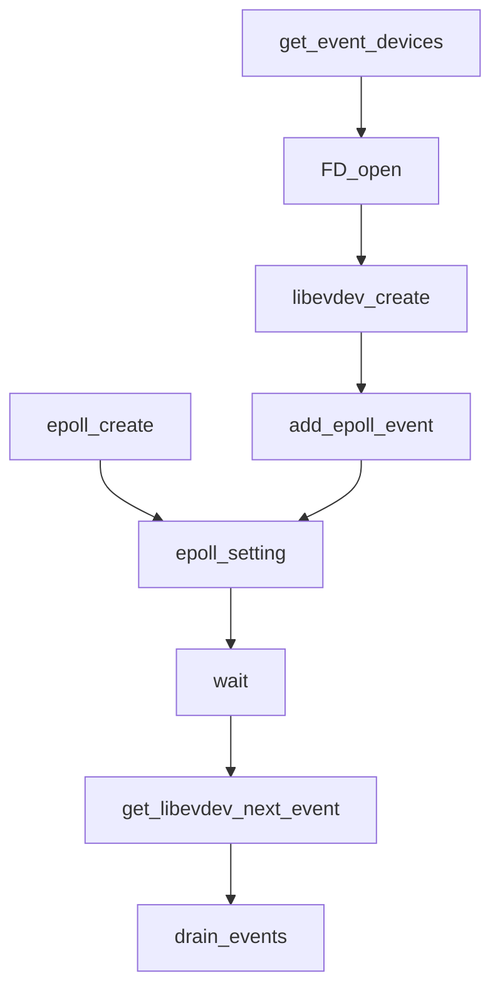
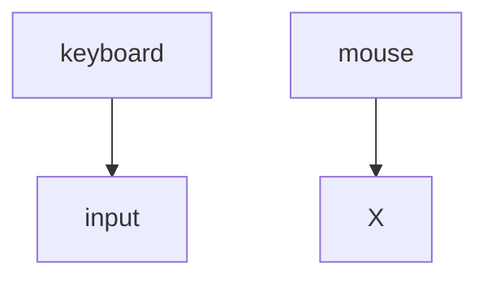
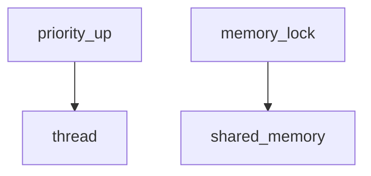

```mermaid
flowchart TD

get_event_devices --> FD_open
FD_open --> libevdev_create
libevdev_create --> add_epoll_event
epoll_create --> epoll_setting
add_epoll_event --> epoll_setting

epoll_setting --> wait
wait --> get_libevdev_next_event
get_libevdev_next_event --> drain_events
```

Sync Strategies

```mermaid
flowchart TD

keyboard --> input
mouse --> X
```

optimization

```mermaid
flowchart TD
priority_up --> thread
memory_lock --> shared_memory
```

